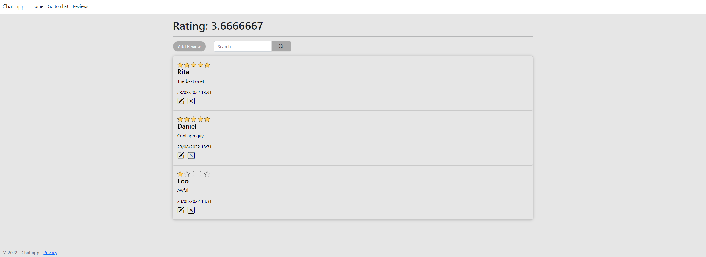

# Chat app Server

Real time Chat app that inculdes both client and server side.   
The server side was build using ASP.NET with entity framework to manage the database of the chat.   
In addition the server includes a rating system that was build with MVC and a service that uses a static list with Dependency Injection.    

## You are currently in the repository of the server side 

## How to run
The client and server sides need to be run separately.  
First the server needs to be run and then the client.  
When both of them are running the client and server will be able to communicate with one another.  
The client will be able to send and recieve information from the server's database,  
In addition the server will be able to send asynchronous notifications to the client-side with signalR.  

### How to run server

#### `git clone`

Clone the repository:  
Open Visual Studio or other ASP.NET IDE and choose "Clone a repository"  
enter the following link:  
https://github.com/DanielTal1/Server-Ex3.git  

#### `download the needed packages`  

Write the following lines int the Package Manager Console:  
Install-Package EntityFramework (if you don't have it already)  
Enable-Migrations(if you didn't use Entity Framework before)  
Update-Database  
This will initialize the database given by entity framework.
Then install firebase Admin.

Lastly install the signalR library by:  
right click on the server-try project=> Add => Client-Side Library  
then choose the following:  
Provider: unpkg  
Library: @microsoft/signalr@6.0.6  
mark choose specific files and choose the files:  
signalr.js, signalr.min.js inside the folders: files=>dist=>browser  
This will enable the signalr library in the server.  

#### `run the project`
port 7038

## How to use the app  

When you first open the app, you will see the login page  
At first the database will be empty of users.  
In order to add a user go over to the signup page and sign up.  
After signing up you will be directed directly to the chat page.  
In order to start a conversion you will need to sign up another user.  
Then you will be able to add each other and enjoy real time chat.  
However, if you choose to add users manualy to the entity framework database please notice the following instructions:  
1. In the User Table the id property must be the same as the username property (done automatically when signing up)  
2. In the Contact Table the id propery will function as the contact's Username  
3. In the Contact Table The UserId is required and will function as the UserName of the user which the contact belong to.  
  
At any time you can head over to the rank system with the link in the bottom of the screen,  
and then head back to the chat app by clicking on "Go to chat" in the menu on the top left corner.  

##

